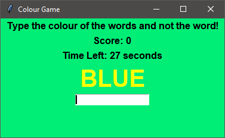

# Colour Game
This is a game where the player is expected to type the colour of the word and not the word which is also a colour.
This may seem confusing, so why don't you try it yourself?

## To Run
python colourgame.py

## Screenshot
How to Play (click on the image)

Type "Yellow" and not "Blue"

When Time Runs Out

#### 
Please do ⭐ the repository, if it helped you in anyway.
